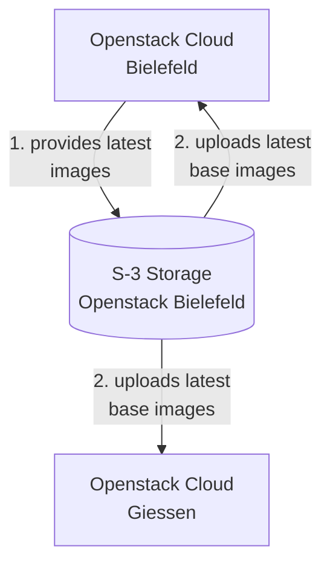
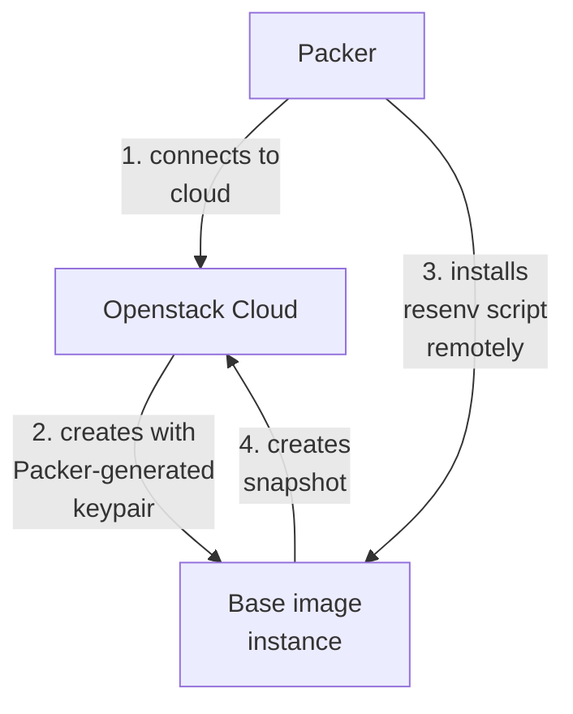
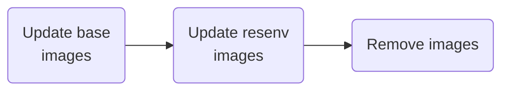
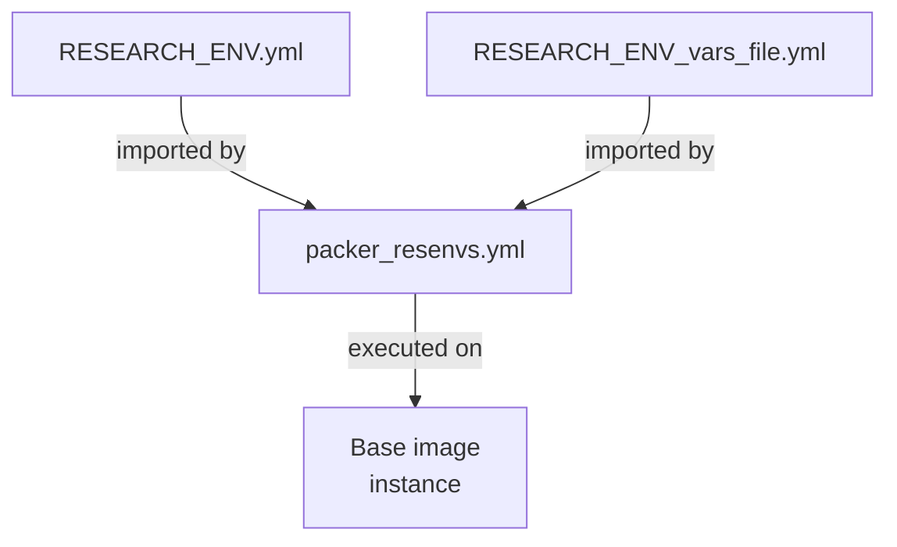

# resenvs
This repository is used to create ready-to-launch images installed with a research environment of choice.

Currently available research environments: VSCode, Guacamole, RStudio, TheiaIDE

## Development workflow
### Base images

Openstack Cloud Bielefeld regularly updates images of different Linux distributions (e.g. Ubuntu). These images will be configured as base images for SimpleVM and uploaded to both Openstack Cloud locations.

### ResEnv images
[Packer](packer.io) is used to create pre-built resenv images.

1. Packer connects to Openstack Cloud and launches an instance from a base image
2. An installing script is executed remotely to equip the created instance with necessary dependencies
3. A snapshot of the prepared instance is created
4. The created snapshot with research environment installed is stored as a new image

### GitHub Action
A GitHub Action is run every working day to manage the automatic update of images. The Action consists of three workflows which can be executed seperately.

1. The images in S3 storage are checked. When there is a newer version of a base image which is not present on Openstack Giessen, it will be downloaded via a S3 tool and uploaded to Openstack Bielefeld and Openstack Giessen
2. After the base image workflow is finished, resenv images will be checkced for both locations. If the newest base image has a later upload date than the newest resenv image, a new version of the resenv image will be built with the newest base.
3. After the resenv image workflow is finished, a worklflow deleting duplicating base and resenv images will be executed. One base image and two images from each resenv will be kept in the cloud locations.

### Composing scripts for Packer
[packer_resenvs.yml](https://github.com/deNBI/resenvs/blob/feat/packer/packer_resenvs.yml) is used to combine ansible script and variable file for any research environment. The generated result will be executed by Packer to install the declared dependencies.

#### Adding a new resenv
Alongside the YAML files containing installation steps and variables, the name for the new resenv should be denoted in [cleanup_resenvs_images.yml](https://github.com/deNBI/resenvs/blob/feat/packer/cleanup_resenvs_images.yml) and a resenv-specific tag should be added to [tags.json](https://github.com/deNBI/resenvs/blob/feat/packer/tags.json).

## Configuration of GitHub Runners
In order to run the workflows with internal GitHub runners, they should have the following dependencies installed:
- [Packer](https://www.packer.io/downloads) (v. 1.8.2 or higher)
- [Minio CLI](https://min.io/download#/linux)  
Also setup valid credentials for Minio client with `./mc alias set osbielefeld https://openstack.cebitec.uni-bielefeld.de:8080 ACCESS_KEY SECRET_KEY`. You can create a keypair with `openstack credential create`
- openstacksdk `pip install openstacksdk`
- OpenStack RC Files for both Bielefeld and Giessen under home directory, named after `packer-rc-{location}.sh` respectively
